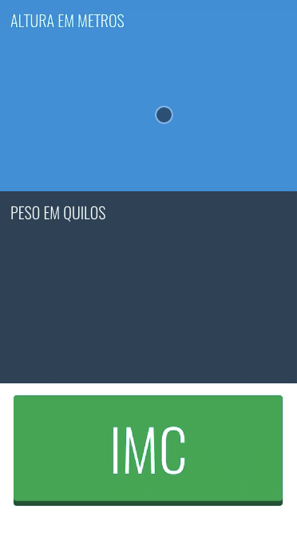

# IMC Calc

Web app that calculates (BMI) Body Mass index. Design and code by [@harlley](https://github.com/harlley)



## Tech Stack

* HTML5
* CSS3 (Flexbox)
* Vanilla Javascript
  

## How To Use

To clone and run this application, you'll need [Git](https://git-scm.com) and [Node.js](https://nodejs.org/en/download/) (which comes with [npm](http://npmjs.com)) installed on your computer. From your command line:

```bash
# Clone this repository
$ git clone https://github.com/harlley/imc-calc

# Go into the repository
$ cd imc-calc

# Install dependencies
$ npm install

# Run the app
$ npm start
```

Note: If you're using Linux Bash for Windows, [see this guide](https://www.howtogeek.com/261575/how-to-run-graphical-linux-desktop-applications-from-windows-10s-bash-shell/) or use `node` from the command prompt.


## License

MIT

---

> [harlleyoliveira.com.br](http://harlleyoliveira.com.br) &nbsp;&middot;&nbsp;
> GitHub [@harlley](https://github.com/harlley) &nbsp;&middot;&nbsp;
> Twitter [@harlleydev](https://twitter.com/harlleydev)

